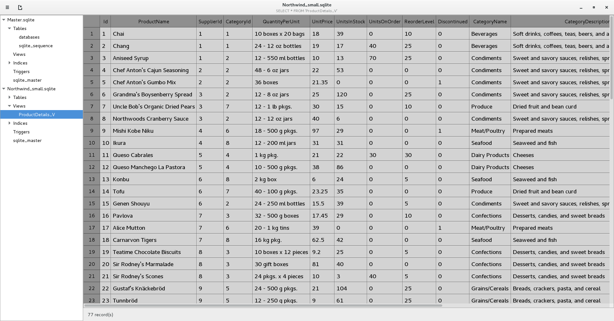
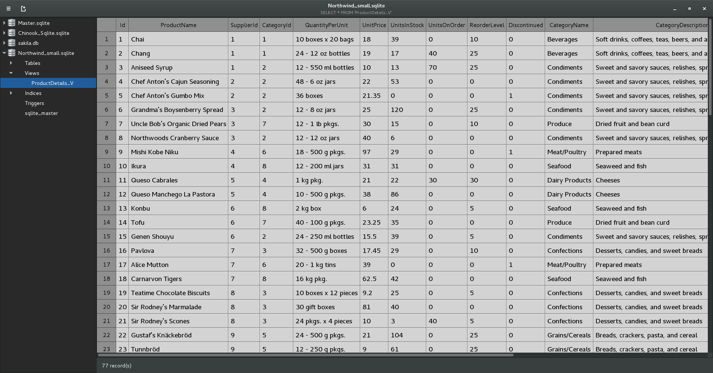
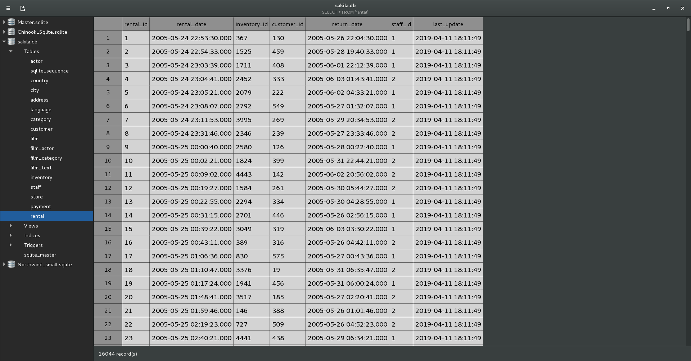

Browse SQLite databases
=======================

SQLite Browser is a GTK desktop application to visually browse SQLite databases.

It has the following features:

 - written using a mixture of C and C++. The intention is for it to be fast and lightweight.
 - can handle an unlimited number of rows via virtual tables, it has been tested up to 100 million rows.
 - stores multiple databases in its central Master.sqlite database.
 - can be launched standalone or on double clicking a .sqlite or .db file.

It does not (yet) have the feature to create or edit new databases. Currently, the data in individual cells can be copied.

Installation
------------
<code>git clone https://github.com/carefree-coder/sqlite-browser.git</code>  
<code>cd sqlite-browser</code>  
<code>./autogen.sh [optional arguments]       eg: ./autogen.sh --prefix=/usr</code>  
<code>make</code>  
<code>make install</code>  

- the application should appear in your main menu.
- Or, you can type "<b>sqlite-browser</b>" from a command line.
- Or, you can double-click on any sqlite database file to launch the app.

Screenshots
-----------
  \
  \
  \
  \
  

